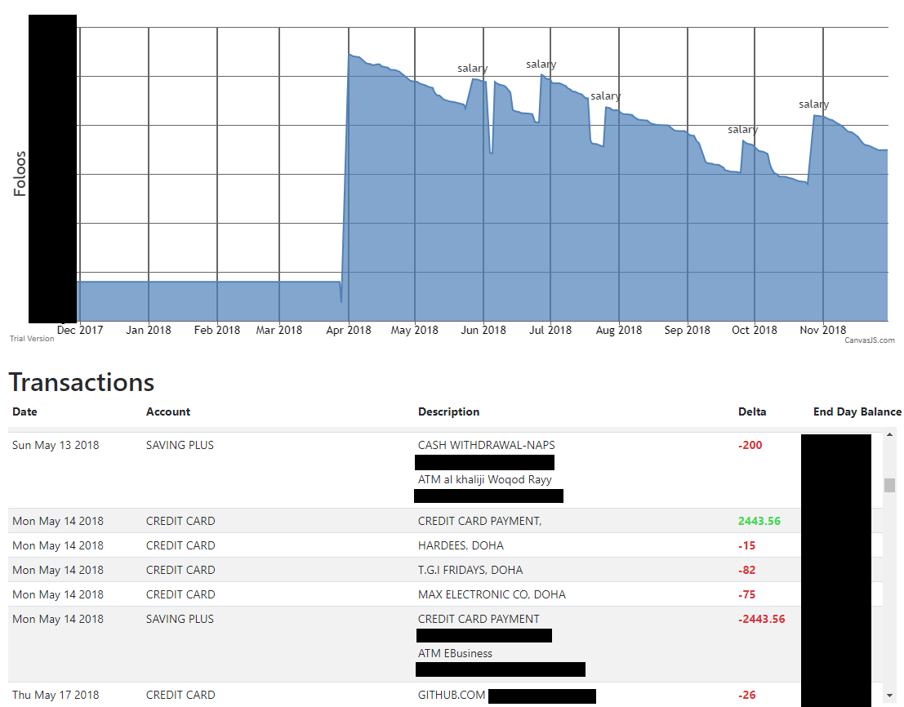

# Money Tracker
Some banks, like mine (QNB), don't give you any visualization/insight on your account spending & habits. They also don't support integration with any application that does this sort of visualization. Tracking this data manually (upon spending or getting paid) is a pain, especially if you want to account for interest and transaction fees.

Money Tracker is a utility that fetches your bank statements from your E-mail, parses them and puts them together to show you a visual representation of your account(s) and spending. No need for any explicit integration from the bank's side or any API to directly access your bank account's information.

## Running
This project uses python 3+
- (Optional) Setup a virtual environment (e.g. using `virtualenv` and `python3.6`: `virtualenv .env --python=python3.6`). Notice that you will have to activate the virtual environment every time you want to run the code in a new terminal (e.g. for `virtualenv`: `.env/bin/activate`)
- Install the pip packages: `pip install -r requirements.txt`
- Run
```bash
./fetch_messages.py
./extract_texts.py
./parse_data.py
```

## Screenshots
